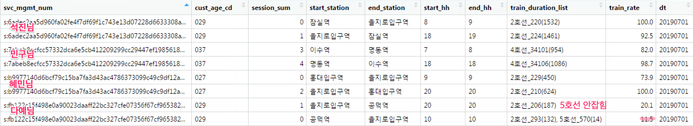

# 190821 실시간 열차 위치 → 통계성 검증

**Original**

- data.subway_train_time_loc_hst 사용
    - twifi 고객의 전후 30초 기지국(기존에 사용하던 열차 메타)
- 열차별 최소 n ≥ 2
    - 열차별로 log가 2번은 찍혀야 열차 후보에 오르고, 열차 후보들 중에서 가장 긴시간동안 잡히는 열차가 매핑됨

**1차 시도**

- dy_public_data_subway_loc_201907 사용
- 잠실역이라면 잠실역 전체의 기지국(2호선 + 8호선)을 붙임
- 열차별 최소 n ≥ 2

- 열차별 최소 n ≥ 3

**2차 시도**

- dy_public_data_subway_loc_201907_subwaycode 사용
- 2호선 열차가 잠실역이라면 2호선 잠실역 전체의 기지국을 붙임
- 열차별 최소 n ≥ 2

- 열차별 최소 n ≥ 3

---

**→ (결론) 역사의 전체 기지국(호선을 고려하지않는)이냐, 일부 기지국(호선을 고려한)이냐보다 n≥2 or n≥3 기준이 훨씬 큰 영향을 미친다**

**→ n≥3 기준보다 한 train이 2개 이상 역사를 함께 이동했는지로 바꾸면 어떨까?**

3**차 시도**

- dy_public_data_subway_loc_201907_subwaycode 사용
- 2호선 열차가 잠실역이라면 2호선 잠실역 전체의 기지국을 붙임
- 열차별 최소 n ≥ 2 or n ≥ 3 기준 없애고 **한 train이 2개 이상의 역사를 함께 이동했는지**로 변경

**[ 결과 ]**

**[ 장단점 ]**

- 장점
    - Original 대비 석진님 퇴근길, 다예님 출퇴근길이 더 잡히는 것은 장점
    - trip 갯수 얼마나 차이나는지 확인하기

- 단점
    - 석진님 : 5호선 구간 (동대문역사문화공원 - 을지로4가 구간) 계속 잡힌다.
    - 인범님 : 버스/KTX인데 잡힌다 & 비율도 높다

**[ 문제점 원인 찾기 : dedup ]**

**→ (결론) 이 부분에 대해서 의사결정을 혼자서는 못하겠다. 나쁘지 않은 것 같기도 하고, 눈에 거슬리기도 하고. 그냥 앞으로 계속 진행해야겠다.**

**→ 그래도 규모는 한 번 비교해보자**

### **열차 위치 데이터에 따른 지하철 세션 규모 비교**

- 대조군
    - 열차 데이터 : data.data.subway_train_time_loc_hst
    - 세션 데이터 : data.subway_svc_session_daily
    - 열차 맵핑 최소 조건 : n(log) ≥ 2
- 실험군
    - 열차 데이터 : default.dy_public_data_subway_loc_201907_subwaycode
    - 세션 데이터 : subway_svc_session_daily_public3
    - 열차 맵핑 최소 조건 : 맵핑 역사 갯수 ≥ 2

- 비교 기간 : 20190701 ~ 20190731
- 조건 : 수도권 & 주요 이용 호선 in ('1호선', '2호선', '3호선', .... , '9호선') & train_rate > 10
- 문제점 :
    - 대조군은 전체 열차 위치를 통해서 train_rate를 계산
    - 실험군은 (이번에는)일부 호선 열차 위치를 통해서 train_rate를 계산
    - **⇒** **실험군에서 규모가 적게 잡힐 수 있음**

- 결과
    - 실험군이 대조군 대비 10% 정도 규모가 적게 잡힘
    - 2019년 7월 1-9호선 승차인원 합계 (152,744,810) 대비 대조군은 42.2%, 실험군은 36.1% 수준

- 실험군에서 20190721 데이터가 없음 → 공공데이터에서 해당날짜 데이터가 없는데 API fail인지 확인

---

- 구성원을 대상으로 비교 (20190721 제외)
    - 대체로 거의 유사하거나 조금씩 줄어드는데, 인범님과 혜민님만 급격하게 증가

- 인범님

    

- 혜민님

    

- 다예님

    

    

    

**통계성 열차 혼잡도 한바퀴 태우기**

### 통계성 열차 혼잡도 검증 순서

1) 호선별 트립 추출 → 2) 빈 구간 채우기 → 3) 역사별 열차 도착 시간 맵핑 → 4) 시간별,역사별 summary

### 1) 호선별 트립 추출

- 4호선, 8호선, 9호선(일방향)에 대해서 진행. 4호선과 9호선은 급행 존재.
- 7월 1일 (월)에 대해서 열차번호 맵핑된 9호선 트립은 179,856건

### 2) 빈구간 채우기

- 실시간 데이터의 정차역 메타 완성되면 사용 예정
- 지금은 subway_code의 sequence 방법 사용하였음

ex) 노량진에서 등촌역까지 9097 열차를 타고 이동한 고객

### 3) 역사별 열차 도착 시간 맵핑

- dy_public_data_subway_loc_201907_raw 활용 → 역사별 역사 도착 시간
    - 0, 1, 2 등의 복잡한 문제는 혜민님이 풀어주실 거라고 생각하고 우선 평균내서 사용
    - 급행 열차인데도 일반 역사 진입 시간이 존재함
    - **급행 열차의 경우 일반 역사의 도착시간을 manually 삭제함**

- **9542 열차**는 하행 급행인데, **29544초**에 **가양역**에 도착할 때 SKT 고객 **252명**이 타고 있었다

### 4) 통계성 열차 혼잡도 Summary

- **여의도역**
    - 급행이 일반보다 최고 기준 1.5배 정도 사람이 많음
    - 급행열차 : 모두 6량 / 일반열차 : 6량 4량 혼합

- 신논현역
    - 신논현에서 8시 10분에 내리는 열차는 타면 안된다
    - 일반과 급행의 차이가 심한데...

- 혼잡시간대 9호선
    - 600명 / 6(량) * (100/36) = 277명           ⇒ 혼잡도 175% 수준

---

- 공공데이터/twifi) 두 개 세션을 교집합 → 두 종류의 열차 번호를 남길 수 있도록...
    - 8월 달 중순부터...
- 공공데이터 버전 여러 호선에 대해서 한달치 output
- y scale은 나중에 다시 생각하기